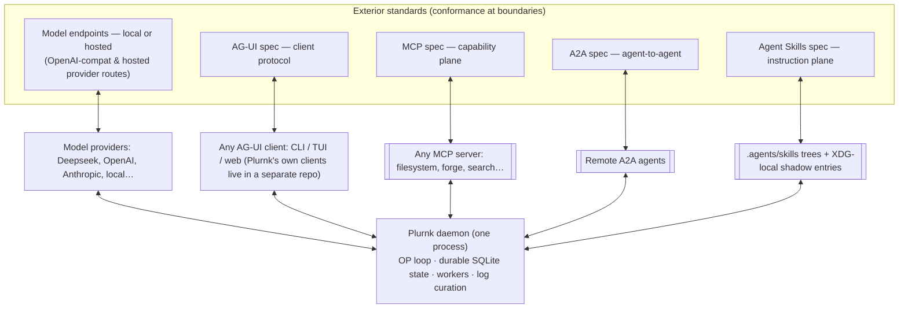

```mermaid
flowchart TB
    subgraph standards["Exterior standards (conformance at boundaries)"]
        MODEL["Model endpoints — local or hosted<br/>(OpenAI-compat & hosted provider routes)"]
        AGUI["AG-UI spec — client protocol"]
        MCP["MCP spec — capability plane"]
        A2A["A2A spec — agent-to-agent"]
        SKILLS["Agent Skills spec — instruction plane"]
    end
    PLURNK["Plurnk daemon (one process)<br/>OP loop · durable SQLite state · workers · log curation"]
    MODELS["Model providers: Deepseek, OpenAI, Anthropic, local…"]
    CLIENTS["Any AG-UI client: CLI / TUI / web (Plurnk's own clients live in a separate repo)"]
    MCPS[["Any MCP server: filesystem, forge, search…"]]
    AGENTS[["Remote A2A agents"]]
    SKILLT[[".agents/skills trees + XDG-local shadow entries"]]

    MODEL <--> MODELS
    AGUI <--> CLIENTS
    MCP <--> MCPS
    A2A <--> AGENTS
    SKILLS <--> SKILLT
    MODELS & CLIENTS & MCPS & AGENTS & SKILLT <--> PLURNK
```
